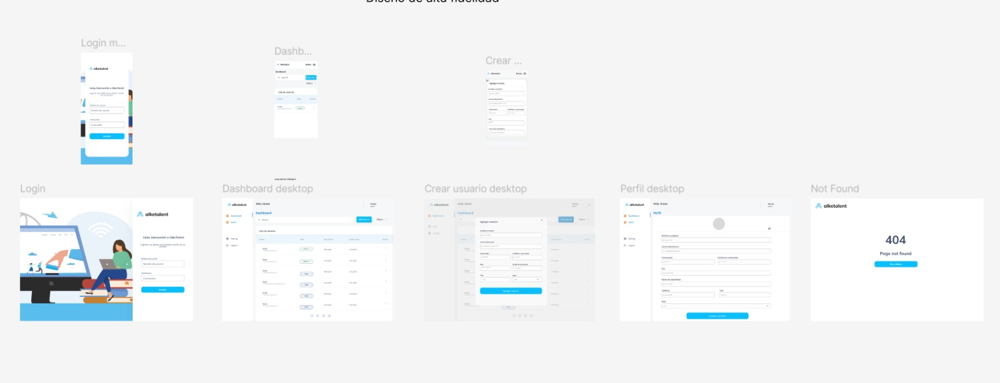

# CENCO-MIT-Front-T1

## Project Overview 📍

This project is the frontend for the User Management Platform developed for TalentAlke. The aim is to build a user-friendly interface that allows users to interact with the system, facilitating registration, data entry, and information management. We will be using React and Vite to create a modern, fast, and efficient user interface.

[User Management Design on Figma](https://www.figma.com/design/VvCFVh2dR3Am2IY9wNKoZS/User-Management?node-id=0-1&t=Af86guPittelMT3A-1)

## Dependencies & Justifications 🛠️

### Mandatory Libraries

- **`react-router-dom`**: For handling routing within the application. It allows us to define routes and navigate between different pages of the app efficiently.
- **`@mui/material`**: Provides Material UI components to help us build a responsive and visually appealing interface.
- **`@reduxjs/toolkit`**: Simplifies state management in React applications with Redux. It helps manage the application state in a predictable manner.
- **`axios`**: For making HTTP requests to the backend API. It provides a clean API for handling requests and responses.

### Project Structure & Naming Conventions

- **Folder Structure**:
  - `src/`: Contains all source files
    - `components/`: Reusable UI components
    - `pages/`: Page components
    - `redux/`: Redux-related files (slices, store)
    - `api/`: Axios configuration
    - `hooks/`: Custom React hooks
    - `interfaces/`: TypeScript interfaces and types
    - `navigation/`: Navigation configuration and page components
  - `public/`: Static files
  - `assets/`: Images, fonts, etc.
- **Naming Conventions**:
  - Use PascalCase for React components and directories.
  - Use camelCase for functions and variables.
  - Use SCREAMING_SNAKE_CASE for constants.
